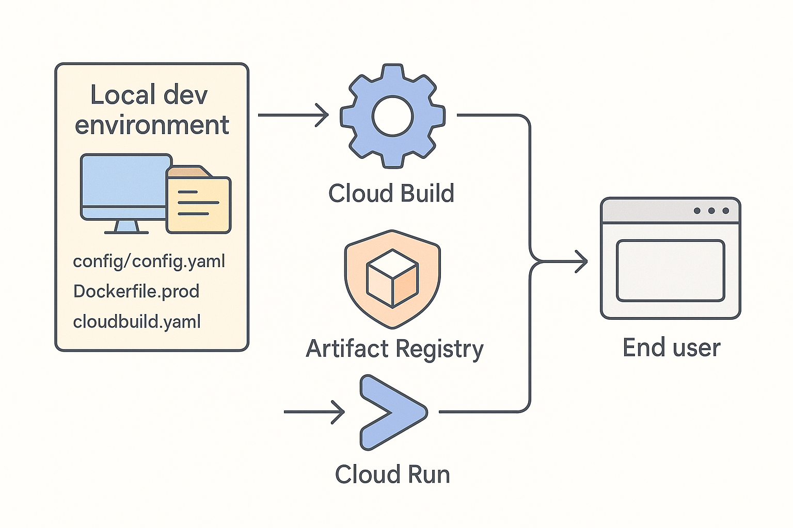
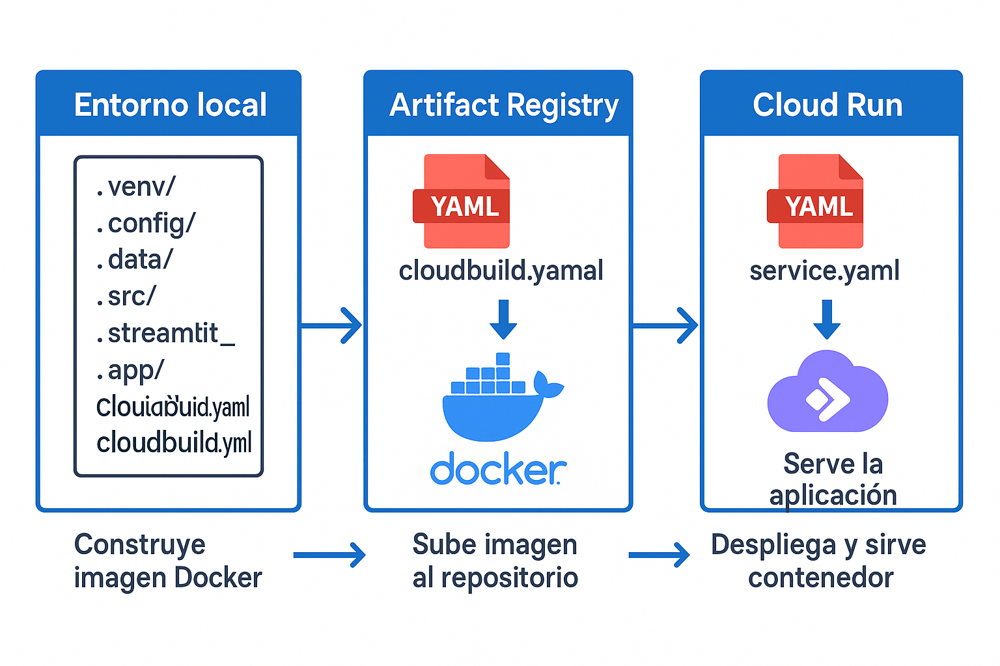
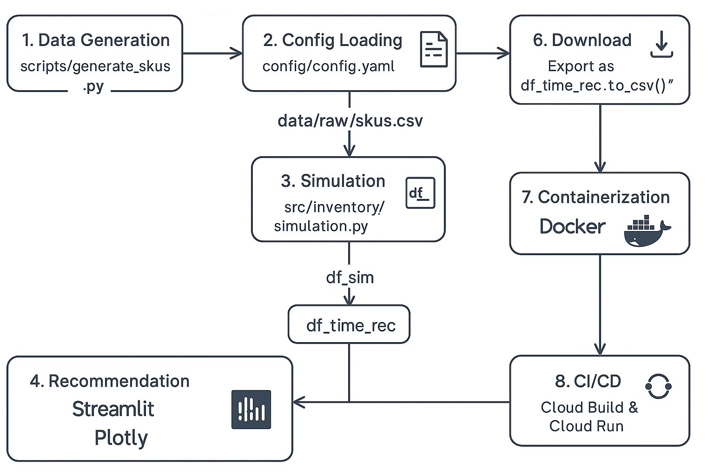

# Inventory Manager 🚀

## Descripción  
**Inventory Manager** es una herramienta interactiva para simular la evolución de inventario en bodegas de Mercado Libre y sugerir automáticamente recomendaciones de compra por SKU según **Days On Hand** (DOH), capacidad máxima y saturación objetivo.  

## Objetivo del proyecto
El algoritmo que desarrollamos es capaz de determinar la cantidad de inventario que se debe de comprar para cada SKU del almacen. En ese sentido, deber poder determinar:
- Si un SKU se encuentra en exceso (no requiere que Mercado Libre compre más stock).
- Si un SKU se encuentra en escasez (Mercado Libre necesita comprar inventario para satisfacer la demanda) y cuánto necesita adquirir.

## Input iniciales
1. Inventario inicial en el almacen.
2. Ventas por Item.
3. Stock actual de cada item.

## Assumptions tomados en el desarrollo del proyecto
- Se asume que todos los SKUs tienen una venta diaría promedio estable.
- Se asume que el FC tiene un stock máximo determinado y una "saturación sana" establecida.
- Se asume que **todos** los SKUs tienen la **misma cantidad de DOH** que querrmos tener en el FC entendiendo como 1 Days On Hand a la cantidad de stock necesario para surtir la venta de un día tomando como referencia la venta promedio diaría de cada SKU.

## Flujo de trabajo propuesto
1. Tomar un périodo de tiempo de dís como input del usuario y calcular la evolución del stock en el tiempo y mostrarlo visualmente.
2. Tomar todos los inputs necesarios para calcular cuánto más inventario de cada SKU se necesit para llegar a los DOH por SKU establecidos.

## ⚙️ Parametros necesarios
Archivo `config/config.yaml`:

```yaml
max_capacity: 650000         # Capacidad máxima total
initial_capacity: 400000     # Stock inicial total
saturation_target: 0.95      # Saturación objetivo (95%)
default_doh: 7               # Días On Hand por SKU
analysis_period_days: 30     # Días a simular por defecto
```

## Principales algoritmos:
### `simulate_inventory(df_skus, analysis_days, start_date=None)`

Simula la evolución diaria del inventario de cada SKU.

Esto lo logra tomando como base el stock de cada SKU y por cada días del periodo seleccionado por el usuario se resta un el número de compras diarias promedio de ese SKU y se guarda la evolución del stock en el tiempo hasta agotar todo el inventario.

```python


# Ejemplo de SKUs
df_skus = pd.DataFrame({
    'sku_id': ['A', 'B'],
    'stock': [10, 5],
    'avg_daily_sales': [3, 2]
})

# Simular 3 días a partir de hoy
df_sim = simulate_inventory(df_skus, analysis_days=3, start_date=date(2025, 7, 28))
print(df_sim)
```
En este ejemplo, el SKU "A" comienza con un stock de 10 unidades, el usuario solicita ver la información en los siguientes 3 días comenzanfo con el día 28 de julio 2025. En el primer día el stock baja a 7 unidades (porque la venta promedio del SKU es 3) y continua iterativamente hasta llegar a día 3 donde el SKU A solamente tendrá una pieza restante.

|    date    | sku_id | stock_level |
|:----------:|:------:|:-----------:|
| 2025-07-29 | A      | 7           |
| 2025-07-29 | B      | 3           |
| 2025-07-30 | A      | 4           |
| 2025-07-30 | B      | 1           |
| 2025-07-31 | A      | 1           |
| 2025-07-31 | B      | 0           |

## **Tecnologías empleadas:**  
- 🐍 Python 3.11+  
- ⚡️ Streamlit  
- 📈 Plotly  
- 🐳 Docker  
- 🔄 Google Cloud Build  
- ☁️ Google Cloud Run  

---

## 🚀 Características principales  
- **Simulación de stock por SKU**: análisis diario del nivel de inventario.  
- **Recomendaciones de compra**: calcula unidades necesarias para cubrir DOH y mantener saturación óptima.  
- **Visualizaciones interactivas**: gráficos combinados de stock y compra con Plotly en Streamlit.  
- **Exportación CSV**: descarga todo el resultado de la simulación.  
- **CI/CD completo**: Docker → Cloud Build → Artifact Registry → Cloud Run.  

---

## 🏗️ Arquitectura del Proyecto  
- **config/**: Parámetros de simulación  
  - `config/config.yaml`  
- **data/**: Datos de ejemplo (SKUs CSV)  
- **src/**: Lógica de simulación y recomendaciones  
- **streamlit_app/**: Aplicación Streamlit (UI)  
- **scripts/**: Generadores y notebooks de prueba  
- **Dockerfile.prod**: Imagen de producción  
- **cloudbuild.yaml**: Pipeline de CI  
- **service.yaml**: Manifest de Cloud Run  
- **.gcloudignore**, **.dockerignore**, **.gitignore**  

### 🌐 Entorno de Producción  
1. **CI/CD**: Cloud Build lee `cloudbuild.yaml`, construye la imagen con `Dockerfile.prod`, etiqueta y envia a Artifact Registry.  
2. **Artifact Registry**: almacena `us-central1-docker.pkg.dev/.../inventory-manager:vX`.  
3. **Despliegue**: Cloud Run consume la imagen, corre el contenedor con `$PORT`.  
4. **Escalabilidad**: autoescalado según tráfico.  
5. **Seguridad**: rol `roles/run.invoker` asignado a `allUsers` para acceso público.  
6. **Monitoreo**: Cloud Logging & Monitoring recolectan logs y métricas.  

# Principales componentes técnologicos utilizados en el despliegue a producción.


# Flujo de trabajo y despliegue del modelo.


---

## 🔄 Flujo de Datos  
1. **Generación de SKUs**  
   - `scripts/generate_skus.py` → `data/raw/skus.csv` (campos `sku_id`, `stock`, `avg_daily_sales`).  
2. **Carga de configuración**  
   - `config/config.yaml` (capacidad, saturación, DOH, período).  
3. **Simulación**  
   - `src/inventory/simulation.py` → `simulate_inventory(df_skus, days)` → `df_sim` (`date`, `sku_id`, `stock_level`).  
4. **Recomendación**  
   - `src/inventory/recommendation.py` → `recommend_purchases_time(df_sim, df_skus, default_doh)` → `df_time_rec` (`purchase_qty`, `status`).  
5. **Visualización**  
   - Streamlit carga `df_sim` + `df_time_rec`, genera gráficos Plotly y tabla de resultados.  
6. **Descarga**  
   - Botón lateral → `df_time_rec.to_csv()` para análisis externo.  
7. **Contenerización**  
   - Docker empaqueta código, dependencias y `config/`.  
8. **CI/CD & Despliegue**  
   - Cloud Build + Cloud Run despliegan automáticamente tras cada push a `main`.  



---


